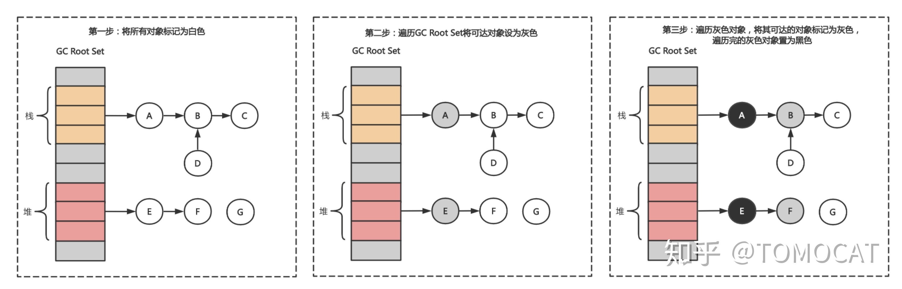
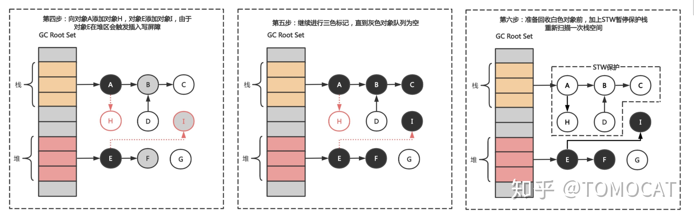
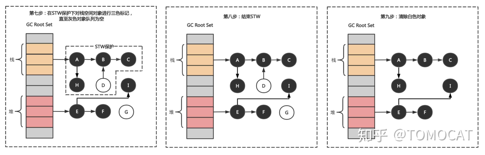
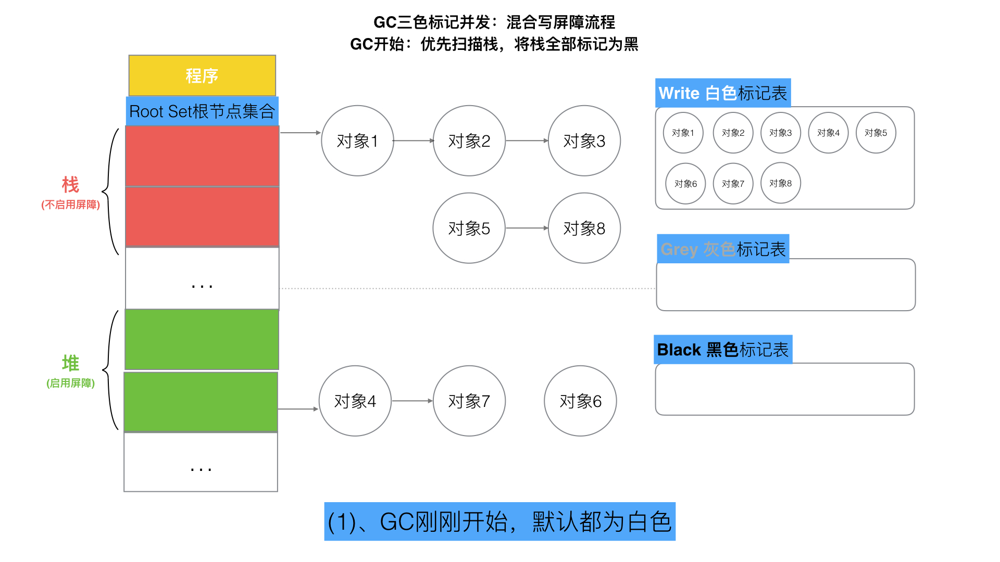
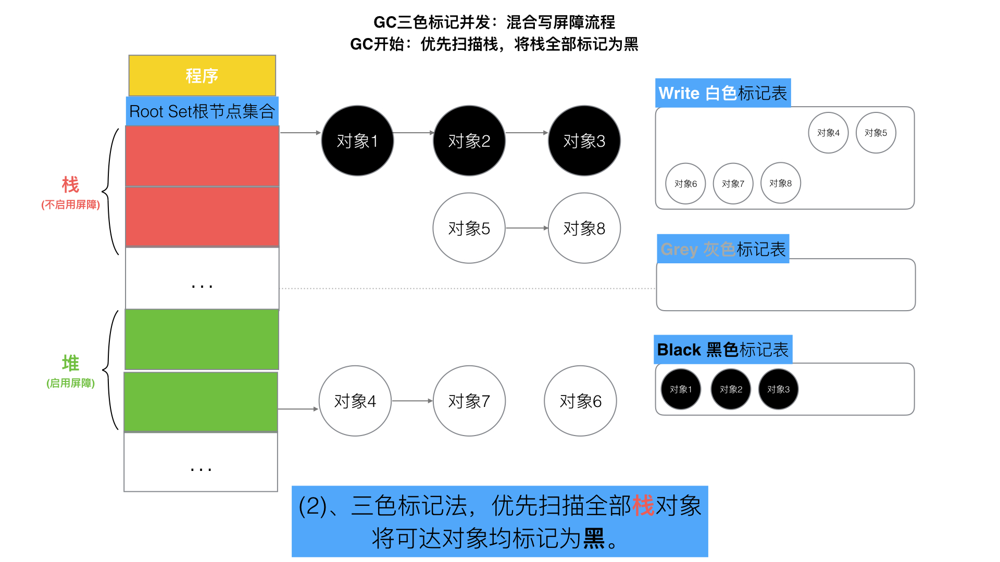
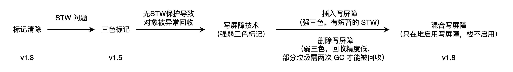
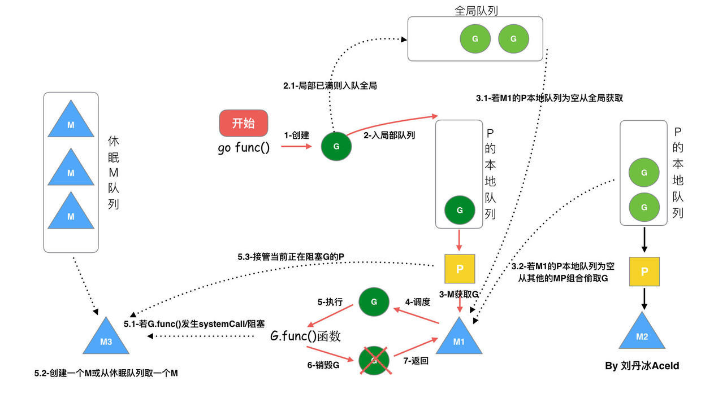
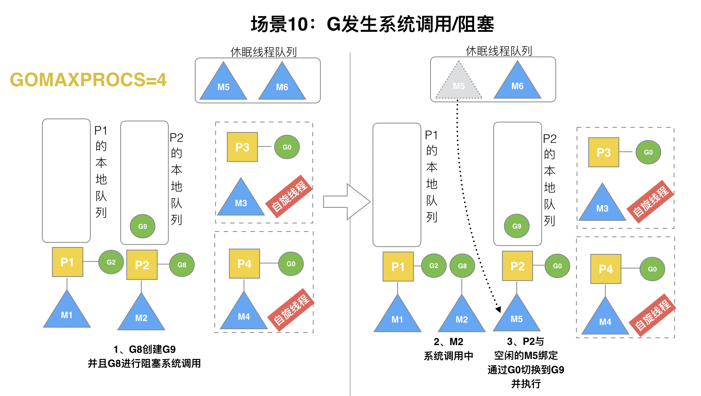
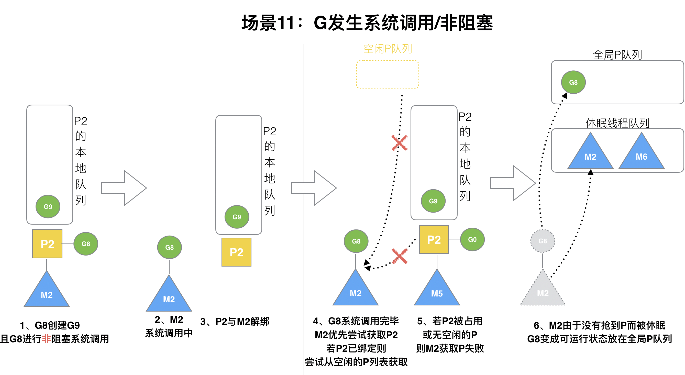

# Golang

## 设计哲学

- [Effective Go](https://go.dev/doc/effective_go)
- [Go at Google](https://go.dev/talks/2012/splash.article)

less is more：编译为本地机器码、带垃圾回收、静态类型；一套极简的 语法（仅 25 个关键字，少到能一口气背完）；以 CSP 为蓝本的并发；以组合而非继承为骨架的类型系统；以及对工具链与构建速度的 极度重视。

## 基础
### 数据类型

```go
bool                                          // 不允许将布尔型强制转换
string                                        // go 中通过反引号`表示语法块
int  int8  int16  int32(rune)  int64          // go 中不允许将整型强制转换为布尔型；rune 代表了一个 Unicode 字符
uint uint8(byte) uint16 uint32 uint64 uintptr // byte 代表一个 ASCII 字符；由于uint8的取值范围是 0~255，因此也可以很好的表示RGB十进制的取值范围；uintptr 被设定为足够存放一个指针
                                              // int 与 uint 自适应32与64位平台
byte                                          // uint8 的别名，表示一个 ASCII 字符
rune                                          // int32 的别名，表示一个 Unicode 码点（UTF-8字符）
float32 float64                               // 应该尽可能使用 float64，因为 math 包中所有有关数学运算的函数都会要求接收这个类型
                                              // float32占用 4 字节（单精度），float64则占用 8 字节（双精度），指数和小数默认为float64
complex64 complex128                          // 复数类型，分别表示 32/64 位实数和虚数，complex128 为复数的默认类型
```

值类型与引用类型：

- **值类型**：基本类型（`int`、`float64`、`bool`、`byte`、`rune` 等）、`string`、`array`、`struct`、复数；
- **引用类型**：`slice`、`map`、`channel`、`pointer`、`function`、`interface`。引用类型的零值为 `nil`

在Go中，值分配在栈还是堆是由编译器逃逸分析确定的，而非简单通过数据类型确定。比如体积很大的数组、在闭包中被捕获并修改的变量、指针被返回、变量在返回后被引用等情况，都会被分配到堆上。

常见使用坑点：

- **`map`**：未用 `make` 初始化的 `nil map` 可以安全读取，但**写入**（`m[k] = v`）会直接引发 `panic`。
- **`channel`**：对 `nil channel` 进行读写会导致**永久阻塞**（非 panic）；`close(nil)` 会引发 `panic`。
- **指针 / 函数 / 接口**：未初始化的 `nil` 值在执行**解引用 (`*p`)**、**直接调用 (`fn()`)** 或**调用接口方法 (`i.Method()`)** 时会引发 `panic`。
- **`slice`**：`nil slice` 可以安全使用 `append()` 追加元素，无需特意 `make`。


**一切都是值传递**

### make & new

|              | `make()`                              | `new()`                             |
|--------------|---------------------------------------|-------------------------------------|
| **适用类型** | 引用类型：`slice`、`map`、`channel`   | 值类型：`int`、`string`、`struct` 等 |
| **返回值**   | 已初始化的类型本身                    | 指向零值的指针 `*T`                 |
| **使用频率** | 常用                                  | 极少（`var` 声明已自动初始化为零值）|

**注意：**

- 引用类型零值为 `nil`，未经 `make` 初始化直接赋值会引发 `panic: assignment to entry in nil map`
- `cap()` 查看容量，`len()` 查看长度（均适用于 `make` 类型）
- `for...range` 可遍历所有 `make` 类型：
  - `slice` / `array`：返回 `(index, value)`
  - `map`：返回 `(key, value)`
  - `channel`：返回 `(value, ok)`，`ok` 表示通道是否已关闭

### defer

在 Go 中，`return` 并不是一个原子操作，它的执行过程可以拆分为以下三个步骤：

1. 返回值赋值（将返回值写入保存返回值的内存区域）
2. 执行 `defer` 函数（按后进先出 LIFO 的顺序依次执行）
3. 真正的函数返回（执行汇编指令 RET，将控制权交还给调用者）

因此，`defer` 的执行时机介于“返回值赋值”和“真正的函数返回”之间。

<table>
<tr>
  <th>匿名返回值</th>
  <th>具名返回值</th>
  <th>返回值为指针</th>
</tr>
<tr>
<td valign="top">
```go
func f1() int {
    x := 5
    defer func() {
        // 修改的是局部变量 x，而不是返回值
        x++
    }()
    return x
}
```
</td>
<td valign="top">
```go
func f2() (x int) {
    x = 5
    defer func() {
        // 修改的是具名返回值 x
        x++
    }()
    return x
}
```
</td>
<td valign="top">
```go
func f3() *int {
    x := 5
    defer func() {
        x++
    }()
    return &x
}
```
</td>
</tr>
</table>

## 标准库

### 文本与字符串
- `fmt`：格式化输出，常用函数`fmt.Println()`, `fmt.Sprintf()`, `fmt.Printf()`, `fmt.Errorf()`
- `strings`：字符串处理，常用函数 `strings.Contains()`, `strings.Split()`, `strings.Join()`, `strings.ReplaceAll()`, `strings.HasPrefix()`
- `strconv`：字符串与基本类型间的类型转换
    - `strconv.Atoi()`：字符串转整数
    - `strconv.Itoa()`：整数转字符串
    - `strconv.ParseInt()`：字符串转整数
    - `strconv.FormatFloat()`：浮点数转字符串
- `bytes`：处理 `[]byte` 切片
- `regexp`：正则表达式

### 错误处理
- `errors`：
    - `errors.New()`：创建一个新的错误
    - `errors.Is()`：判断错误链中是否存在某个错误
    - `errors.As()`：提取错误链中的特定错误类型
    - `errors.Join()`：合并多个错误

### 并发控制
- `sync`：常用并发原语
    - `sync.Mutex`：互斥锁
    - `sync.RWMutex`：读写锁，适用于读多写少的场景，读并发性能更好
    - `sync.Once`：保证某段代码只执行一次，常用于单例初始化
    - `sync.WaitGroup`：等待一组 goroutine 全部完成
    - `sync.Map`：并发安全的 map
    - `sync.Pool`：并发安全的对象池，可复用临时对象以减少 GC 压力，如在高并发 HTTP 服务中复用 `bytes.Buffer`
- `sync/atomic`：原子操作，常用函数 `atomic.AddInt64()`, `atomic.LoadInt64()`, `atomic.CompareAndSwapInt64()`
- `context`：在 goroutine 间传递截止时间、取消信号和请求级数据
    - `context.Background()`：返回空的根 context，通常作为顶层起点
    - `context.WithTimeout()`：创建带超时时间的 context，到期自动取消
    - `context.WithDeadline()`：创建带截止时间的 context，到期自动取消
    - `context.WithCancel()`：创建可手动取消的 context
    - `context.WithValue()`：创建携带键值对的 context，用于传递请求级数据

### 文件系统
- `io`：最核心的 I/O 抽象接口，如`io.Reader`, `io.Writer`, `io.Closer`，常用函数`io.ReadAll()`, `io.Copy()`
- `os`：跨平台的文件操作、环境变量读取、进程交互等，常用函数 `os.Open()`, `os.ReadFile()`, `os.WriteFile()`, `os.Getenv()`, `os.MkdirAll()`
- `bufio`：包装 `io.Reader`/`io.Writer` 提供带缓冲区的读写，常用函数 `bufio.NewScanner()`, `bufio.NewReader()`
- `path/filepath`：处理文件路径，如`filepath.Join()`, `filepath.Split()`, `filepath.Abs()`, `filepath.Ext()`

### 网络
- `net/http`：HTTP 客户端和服务端，常用函数 `http.Get()`, `http.Post()`, `http.ListenAndServe()`, `http.HandleFunc()`
- `net`：TCP、UDP、IP、Unix Socket 等网络编程，常用函数 `net.Listen()`, `net.Dial()`, `net.ResolveTCPAddr()`
- `net/url`：URL 解析与编码，常用函数 `url.Parse()`, `url.QueryEscape()`, `url.QueryUnescape()`

### 序列化与编码
- `encoding/json`：常用函数 `json.Marshal()`, `json.Unmarshal()`
- `encoding/base64`
- `encoding/xml`
- `encoding/csv`
- `encoding/hex`

### slices/maps
- `slices`：
    - `slices.Contains()`：判断切片是否包含某个元素
    - `slices.Sort()`：对切片进行排序
    - `slices.Compact()`：对切片进行去重
    - `slices.Compare()`：逐元素比较两个切片，返回 0（相等）、-1（s1 < s2）或 +1（s1 > s2）
- `maps`：
    - `maps.Keys()`：返回 map 所有键组成的切片（顺序不固定）
    - `maps.Values()`：返回 map 所有值组成的切片
    - `maps.Clone()`：浅拷贝一个 map
    - `maps.Copy(dst, src)`：将 src 中所有键值对复制到 dst
    - `maps.Equal(m1, m2)`：判断两个 map 是否包含相同的键值对

### 时间与数值计算
- `time`：
    - `time.Now()`：获取当前时间
    - `time.NewTicker()`：定时触发，返回 `<-chan Time`，使用后需 `Ticker.Stop()` 释放资源
    - `time.After()`：一段时间后触发，返回 `<-chan Time`，不可复用
    - `time.Sleep()`：休眠一段时间
    - `time.Since()`：计算时间差，返回 `Duration`
    - `time.Duration`：时间间隔
- `math`：
    - `math.MaxInt64`, `math.MaxFloat64`, `math.Pi`, `math.E` 等常量
    - `math.Abs()`, `math.Pow()`, `math.Sqrt()` 等数学函数
- `math/rand/v2`：普通业务逻辑的随机数生成，如生成随机数验证码、抽奖等
- `crypto/rand`：密码学安全的随机数生成，如生成 UUID、密钥、加密随机数等

### 日志
- `log/slog`：结构化日志库（支持 JSON 格式输出、日志级别控制、Key-Value 键值对日志）

### 运行时
- `flag`：Go 标准库的 `flag` 包可满足基本的命令行参数解析需求，但缺乏必填参数校验、短选项/长选项别名等功能。实际项目中通常选用功能更完整的第三方库 `spf13/cobra`。
- `reflect`：在运行时动态检查变量类型、获取结构体 Tag、动态调用方法（如 ORM 框架和序列化框架大量使用）
- `runtime`：运行时信息与控制
    - `runtime.NumGoroutine()`：当前活跃的 goroutine 数量
    - `runtime.NumCPU()`：当前机器的逻辑 CPU 数量
    - `runtime.GOMAXPROCS(n)`：设置可并行执行的最大 CPU 数，传 0 仅查询不修改
    - `runtime.Gosched()`：主动让出当前 goroutine 的 CPU 时间片
    - `runtime.GC()`：手动触发一次 GC
    - `runtime.Stack(buf, all)`：将当前 goroutine（或所有 goroutine）的调用栈写入 buf

### 测试
- `testing`：Go 内置测试框架，核心类型为 `testing.T`（单元测试）、`testing.B`（基准测试）、`testing.F`（模糊测试），但缺少断言函数，实际项目中通常搭配第三方库 `github.com/stretchr/testify` 使用：
    - `testify/assert`：断言失败后继续执行后续测试
    - `testify/require`：断言失败后立即终止当前测试
    - `testify/mock`：生成 mock 对象，用于隔离外部依赖

## 自带工具

- **`run`**：编译并运行当前模块
- **`test`**：支持单元测试（TestXxx）、基准性能测试（BenchmarkXxx）、模糊测试（FuzzXxx）、代码覆盖率（`-cover`）、竞态检测（`-race`）
- `build`
    - **`-ldflags`**：传递参数给链接器
        - **`-X`**：动态注入变量值，如版本号、构建时间
        - `-w`：去掉 DWARF 调试信息
        - `-s`：移除符号表和调试信息
    - **`-race`**：开启竞态检测
    - **`-gcflags`**：传递参数给 Go 编译器
        - **`-m`**：变量逃逸分析
    - `-trimpath`：移除源码路径（推荐生产环境使用）
    - `-x`：打印编译时调用的底层指令
- **`mod`**
    - **`init`**：初始化模块（生成 go.mod）
    - **`tidy`**：整理依赖（自动增删无用包）
    - `vendor`：将依赖拷贝到 vendor 目录
    - `download`：手动下载依赖包
    - `verify`：校验模块校验和
- **`get`**：添加、修改或升级项目的第三方依赖版本，并更新 go.mod
- `fmt`：格式化代码
- `vet`：静态代码分析工具，检查潜在的代码问题（如错误的 Printf 格式化参数、`sync.Mutex` 被值拷贝等锁误用）
- `env`：查看或修改 Go 的环境变量
- **`install`**：将二进制文件安装到 `$GOPATH/bin`（或 `$GOBIN`）目录下，常用于安装 CLI 工具
- `tool`
    - **`pprof`**：CPU、内存（Heap）、Goroutine、阻塞（Block）等性能分析工具，可以生成交互式命令行或 Web 架构的分析图表
    - **`trace`**：可视化执行追踪工具，可以通过浏览器查看具体的 Goroutine 调度、垃圾回收（GC）暂停时间以及网络 I/O 阻塞情况
    - **`cover`**：将 `go test -coverprofile` 生成的覆盖率文件渲染为 HTML 网页，直观查看哪行代码没被测试覆盖到
    - `compile`：Go 编译器，可用于查看汇编代码（如 `go tool compile -S main.go`）
    - `link`：Go 链接器
    - `cgo`：处理 Go 与 C 语言互操作的工具
    - `nm`：查看二进制文件中的符号表
    - `objdump`：对 Go 二进制文件进行反汇编
    - `addr2line`：将二进制文件的指令地址转换为源码对应的文件名和行号
- `generate`：配合代码中的 `//go:generate` 注释，自动触发代码生成脚本（如生成枚举映射、Protobuf 代码等）
- `work`：方便在本地同时修改和调试多个相互依赖的 Go 模块
- `clean`：清理编译产生的临时文件、对象文件和缓存
- `fix`：自动修复（不推荐直接使用，容易破坏代码逻辑）

## 底层原理

- [Go语言原本](https://golang.design/under-the-hood/)
- [Go语言101](https://gfw.go101.org/article/101.html)


### 内存

Go 采用线程缓存分配（Thread-Caching Malloc，**TCMalloc**），将对象根据大小分类，并设计多层级（线程缓存、中心缓存、页堆）的组件提高内存分配器的性能。

| 层级 | 线程独占 | 需要锁 | 用途 |
| --- | --- | --- | --- |
| Thread Cache（mcache） | ✅  | ❌  | 每个线程（P）的小对象分配 |
| Central Cache（mcentral） | ❌  | ✅  | 共享的中层缓存 |
| Page Heap（mheap） | ❌  | ✅  | 管理大对象与页级内存 |

> Go 运行时的堆内存分配机制（如 mcache 和 mcentral）是线程安全的，goroutine 间无需额外锁即可安全分配内存。

#### 变量逃逸分析
- 函数变量的内存默认会分配在栈上，栈的分配与回收都非常迅速；堆适合不可预知大小的内存分配，可动态扩张或缩减。当进程调用 `malloc` 等函数分配内存时，新分配的内存就被动态加入到堆上。当利用 `free` 等函数释放内存时，被释放的内存从堆中被剔除。但是为此付出的代价是分配速度较慢，而且会形成内存碎片。
- Go 通过编译器分析代码的特征和代码的生命周期，决定应该使用堆还是栈来进行内存分配。
- **如果变量在函数外部没有引用，则优先放在栈中；否则放在堆中**；如果编译器无法确定是否被外部引用，同样会放在堆内存中，如 `interface{}`

#### GC

三色标记法的操作步骤为：

1. 新创建的对象默认颜色均为白色
2. 从根节点遍历所有对象，深度为 1，并将可达对象由白色标记为灰色
3. 遍历灰色对象，并将可达的节点标记为灰色，当前节点标记为黑色
4. 不断遍历灰色对象，直至所有对象只有黑色和白色为止
5. 回收所有标记为白色的不可达对象





Go 1.8版本开始采用混合写屏障机制，避免了插入写屏障（结束时需要 STW 来重新扫描栈，标记栈上引用的白色对象的存活）和删除写屏障（回收精度低）的缺点，同时只在堆上启用屏障技术，栈上则不启用，整体过程几乎不需要 STW，因此效率较高

1. GC 开始将栈上的对象全部扫描并标记为黑色 (之后不再进行第二次重复扫描，无需 STW)
2. GC 期间，任何在栈上创建的新对象，均为黑色
3. 被添加或删除的对象标记为灰色

<div class="grid cards" markdown>
- <figure>
    
    <figcaption>三色标记1</figcaption>
  </figure>
- <figure>
    
    <figcaption>三色标记2</figcaption>
  </figure>
</div>

GC 的触发条件有两个：

1. 超过内存大小阈值
2. 达到定时时间



#### 常见的内存泄露场景

1. 无缓冲 Channel 向无接收者的 channel 发送数据，或从无发送者的 channel 接收数据且无 select default/timeout
2. 读写 nil channel 导致 Goroutine 永久挂起
3. sync.WaitGroup 的 Add 和 Done 计数不匹配导致 Wait() 永远阻塞
4. slice 截取大数组，如 `hugeSlice[:2]` 导致对底层的大数组的指针引用，无法回收，应该使用 `append([]T(nil), hugeSlice[:2]...)` 或 `slices.Clone()` 深拷贝所需数据
5. 资源未被关闭，如HTTP Response Body、文件、数据库连接等

### 调度器

#### GMP

- G（Goroutine）是 Go 语言调度器中待执行的任务，它在运行时调度器中的地位与线程在操作系统中差不多，但是它占用了更小的内存空间，也降低了上下文切换的开销
- M（Machine）是操作系统线程。调度器最多可以创建 10000 个线程，但是其中大多数的线程都不会执行用户代码（可能陷入系统调用），最多只会有 `GOMAXPROC` 个活跃线程能够正常运行
    - 在默认情况下，一个四核机器会创建四个活跃的操作系统线程，每一个线程都对应一个运行时中的 `runtime.m` 结构体。
    - 在大多数情况下，我们都会使用 Go 的默认设置，也就是**线程数等于 CPU 数，默认的设置不会频繁触发操作系统的线程调度和上下文切换**，所有的调度都会发生在用户态，由 Go 语言调度器触发，能够减少很多额外开销。
- P（Processor）是线程和 Goroutine 的中间层，它能提供线程需要的上下文环境，也会负责调度线程上的等待队列，通过处理器 P 的调度，每一个内核线程都能够执行多个 Goroutine，它能在 Goroutine 进行一些 I/O 操作时及时让出计算资源，提高线程的利用率。

- Go 用本地和全局两个队列来存放待运行的协程任务，前者用数组构成的环形链表，最多可以存储 256 个待执行任务；后者只有在本地队列没有剩余空间时才会使用
- 调度器的设计策略（[视频教程](https://www.bilibili.com/video/BV19r4y1w7Nx?p=1)）
    - 任务窃取调度器：
        - 基于工作窃取的多线程调度器将每一个线程绑定到了独立的 CPU 上，这些线程会被不同处理器管理，不同的处理器通过工作窃取对任务进行再分配实现任务的平衡，也能提升调度器和 Go 语言程序的整体性能。
        - 窃取任务时，**先从全局**队列获取，**再从其它本地队列**窃取，这样是为了**防止全局队列中的任务饥饿**
        - 在某些情况下，Goroutine 不会让出线程，进而造成饥饿问题。
        - 时间过长的STW会导致程序长时间无法工作
    - 抢占式调度器：
        - 基于协作的抢占式调度器 - 1.2 ~ 1.13。某个协程不释放 CPU 会导致其它协程的饥饿问题
        - 基于信号的抢占式调度器 - 1.14 ~ 至今。即使某个协程不释放 CPU，也会被调度器强制释放

- 调度器的启动
    - M0：程序启动后编号为 0 的第一个线程
    - G0：启动 M 时，第一个创建的协程，每个 M都有属于自己的 G0。G0 仅用于调度其它协程，G0 不执行任何函数


<div class="grid cards" markdown>
- <figure>
    
    <figcaption>阻塞调用</figcaption>
  </figure>
- <figure>
    
    <figcaption>非阻塞调用</figcaption>
  </figure>
</div>